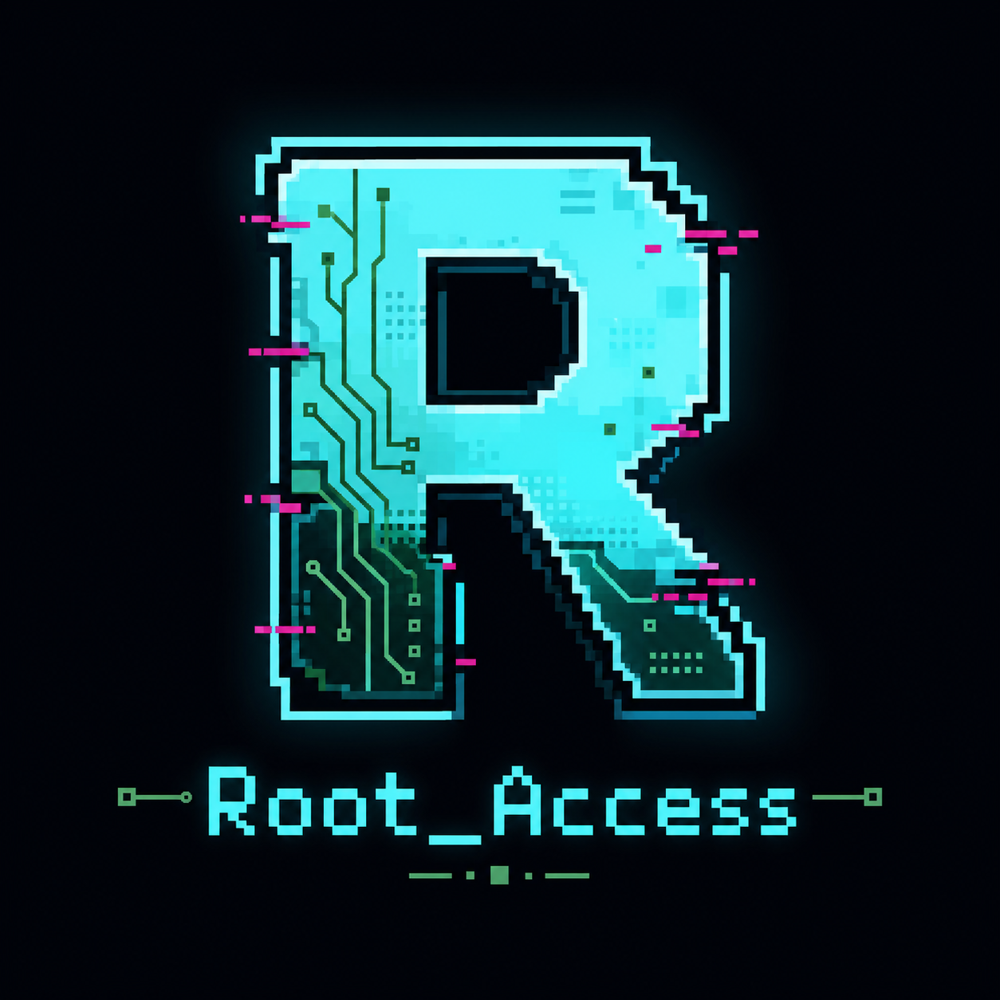

<p align="center">
  
</p>

<h1 align="center">Root_Access</h1>

<p align="center">
  A top-down 2D browser game about reclaiming corrupted space by building safe-zone hardware nodes.
</p>

<p align="center">
  <a href="https://github.com/">Live Game</a>
  |
  <a href="https://github.com/">Repository</a>
</p>

---

## Overview

Root_Access is a 2D top-down action-survival game built with Python, Pygame, and Pygbag. The player moves through a dark corrupted environment, destroys incoming enemies, collects scrap, and spends that scrap to build safe-zone nodes.

The project is designed to run fully static in the browser through GitHub Pages:

- no backend
- no database
- no server runtime
- no external game services
- Pygbag-compatible async game loop

---

## What Is Root_Access?

Root_Access is a browser-playable Pygame game where the player expands protected territory inside a hostile digital environment.

At the gameplay level, Root_Access acts as:

- a top-down movement shooter
- a safe-zone expansion game
- a node-building survival prototype
- a static web game powered by Pygbag

---

## Problem It Solves

Many beginner Pygame projects stay locked to desktop-only execution and become difficult to share. Root_Access is structured around a different goal: make a Python game that can be hosted publicly as a static browser game.

The project focuses on:

- simple readable OOP
- flat, beginner-friendly imports
- clean game entities and systems
- browser deployment through Pygbag
- GitHub Pages publishing

---

## Links

- **Live Game**: Update this after GitHub Pages is enabled
- **GitHub Repository**: Update this after pushing the repo

---

## Latest Game State

Root_Access currently ships with:

- 8-way WASD player movement
- mouse-click shooting
- enemies spawning from screen edges
- bullet and enemy collision detection
- scrap collection from destroyed enemies
- buildable safe-zone nodes
- destructible node hardware
- simple UI for scrap count
- generated logo asset
- procedural non-file-based sound effects for Pygbag compatibility
- GitHub Actions deployment workflow for GitHub Pages

---

## Core Highlights

- fully static browser deployment target
- Python and Pygame gameplay code
- Pygbag async loop using `await asyncio.sleep(0)`
- clean OOP classes for `Player`, `Node`, `Enemy`, and `Bullet`
- separated `entities` and `systems` folders
- safe-zone expansion mechanic
- simple combat and resource loop
- deployment-ready GitHub Actions workflow

---

## Game Surface

### Player experience

- move using `WASD`
- aim with the mouse
- fire with left click
- earn scrap by destroying enemies
- build new nodes with `E`

### Combat experience

- enemies spawn near the edges of the screen
- enemies move in straight lines toward the player's position at spawn time
- bullets destroy enemies on contact
- enemies damage node hardware on contact

### Building experience

- nodes cost `10` scrap
- nodes create visible safe-zone circles
- nodes have health
- destroyed nodes are removed from the game

---

## Why Root_Access

Root_Access is built around a simple game promise:

- enter a corrupted zone
- survive enemy pressure
- collect scrap
- build safe nodes
- expand control over the map

That loop drives the current code structure, gameplay systems, and deployment plan.

---

## Tech Stack

### Game

- Python
- Pygame CE
- Pygbag

### Platform and deployment

- GitHub
- GitHub Actions
- GitHub Pages

### Project organization

- `main.py` for the browser-safe async entry point
- `entities/` for game objects
- `systems/` for gameplay systems
- `assets/` for project visuals

---

## Project Structure

```text
Root_Access/
|- .github/
|  `- workflows/
|     `- deploy.yml
|- assets/
|  `- logo_root_access.png
|- entities/
|  |- bullet.py
|  |- enemy.py
|  |- node.py
|  |- player.py
|  `- __init__.py
|- systems/
|  |- audio.py
|  |- collisions.py
|  |- spawner.py
|  |- spawning.py
|  |- ui.py
|  `- __init__.py
|- main.py
|- settings.py
|- pygbag.ini
|- requirements.txt
`- README.md
```

---

## Architecture

### Entity responsibilities

- `Player` handles movement, boundaries, and drawing
- `Node` handles safe-zone visuals, node health, and hardware collision area
- `Enemy` handles straight-line enemy movement
- `Bullet` handles projectile movement and screen cleanup

### System responsibilities

- `spawning.py` creates enemies safely near screen edges
- `collisions.py` resolves bullet-enemy and enemy-node collisions
- `audio.py` generates small procedural sounds in memory
- `ui.py` draws player-facing interface text

### Game flow

1. The game starts with one central node.
2. The player moves with `WASD`.
3. Enemies spawn from the screen edges.
4. The player shoots toward the mouse cursor.
5. Destroyed enemies award scrap.
6. Scrap can be spent to build more nodes.
7. Enemies damage nodes if they touch the node hardware.

---

## Validation Snapshot

The latest verified project state includes:

- Python syntax check passing
- project import check passing
- Pygbag browser build passing
- build output generated in `build/web`

---

## Key Capabilities

- playable browser game prototype
- clean beginner-friendly Python OOP
- static hosting target
- node building and destruction
- simple combat loop
- generated logo asset
- procedural audio safe for Pygbag builds
- GitHub Pages workflow included

---

## Current Scope

Root_Access is currently a strong early prototype with:

- movement
- combat
- enemy spawning
- resource collection
- node building
- node damage
- browser deployment support

Future versions can add player health, restart screens, enemy waves, upgrades, better animations, map art, and stronger game feel.

---

## Local Setup

### Prerequisites

- Python 3.11+
- Pygame CE
- Pygbag

### Install dependencies

```powershell
py -m pip install -r requirements.txt
```

### Run locally

```powershell
py main.py
```

### Build for browser

```powershell
py -m pygbag --build .
```

### Build output

```text
build/web
```

---

## Build Commands

### Syntax check

```powershell
py -m py_compile main.py settings.py entities/*.py systems/*.py
```

### Pygbag build

```powershell
py -m pygbag --build .
```

---

## Deployment

Root_Access is prepared for GitHub Pages deployment through GitHub Actions.

### GitHub Pages setup

1. Push the project to GitHub.
2. Open the repository settings.
3. Go to `Pages`.
4. Set the Pages source to `GitHub Actions`.
5. Push to the `main` branch.
6. Wait for the `Deploy Pygbag Game` workflow to finish.

The workflow builds the game with Pygbag and deploys `build/web`.

---

## 📄License

This project is licensed under the [MIT License](LICENSE).

That means you can use, copy, modify, merge, publish, distribute, and build on this project, as long as the original MIT license notice is included. The software is provided as-is, without warranty.

---

## Author

<p align="center">
  
</p>

<p align="center">
  <strong>Crafted by MR. Rudranarayan Jena</strong>
</p>

<p align="center">
|  <strong>Founder @Voxion Labs</strong>
</p>

<p align="center">
  Product Builder | Game Developer | Full-stack Developer | AI Enthusiast
</p>

<p align="center">
  Focused on building polished developer products, browser games, real-world applications, and modern AI-assisted workflows.
</p>

<p align="center">
  <a href="https://github.com/liambrooks-lab">GitHub: @liambrooks-lab</a>
</p>

---
